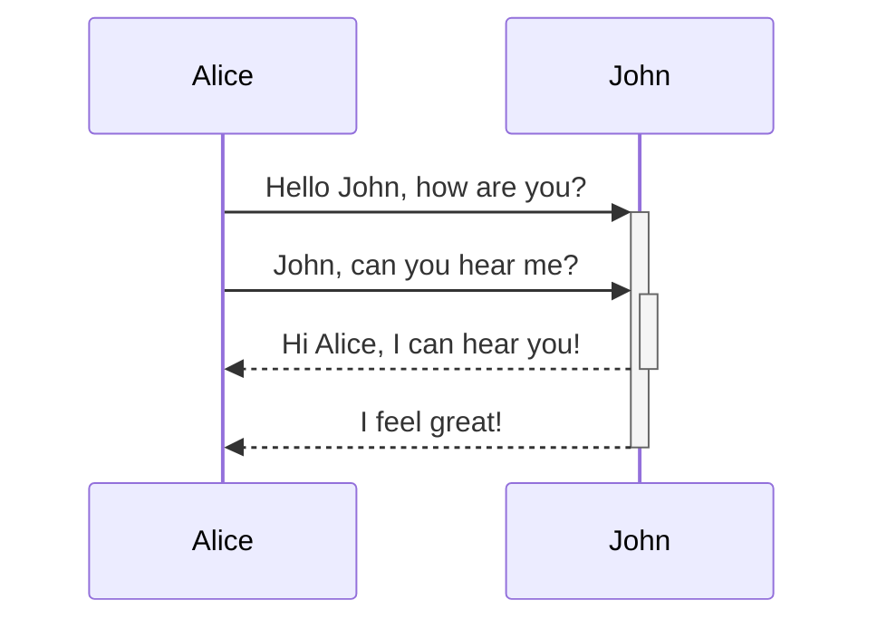
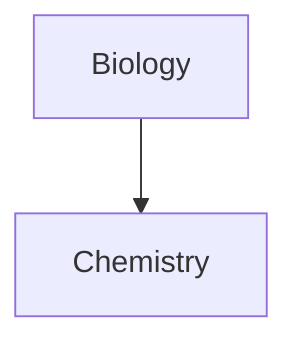

---
tags:
  - Obsidian
  - Markdown
---
# Markdown
[basic Markdown](https://daringfireball.net/projects/markdown/)
[Advanced formatting syntax](https://help.obsidian.md/Editing+and+formatting/Advanced+formatting+syntax).

## Paragraph
separated by **blank line** 

```
This is a paragraph.

This is another paragraph.
```

Multi_Space deemed one in display in [Reading view](https://help.obsidian.md/Editing+and+formatting/Editing+and+previewing+Markdown#Editor%20views) and on [Obsidian Publish](https://help.obsidian.md/Obsidian+Publish/Introduction+to+Obsidian+Publish) sites.
in case of intended multiple spaces, use `&nbsp;` (blank space) and `<br>` (newline)

```md
Multiple          adjacent          spaces


and multiple newlines between paragraphs.
```

> Multiple adjacent spaces
> 
> and multiple newlines between paragraphs.

## Headings
To create a heading, add up to six `#` symbols before your heading text. The number of `#` symbols determines the size of the heading.

```md
# This is a heading 1
## This is a heading 2
### This is a heading 3
#### This is a heading 4
##### This is a heading 5
###### This is a heading 6
```

# This is a heading 1

## This is a heading 2

### This is a heading 3

#### This is a heading 4

##### This is a heading 5

###### This is a heading 6

## Styling text
*Italic* `Alt+I`
**Bold**  `Alt+B`
~~Strikethrough~~ `Alt+S`
==Highlight== `Alt+H`
## Quote `>`

```md
> Human beings face ever more complex and urgent problems, and their effectiveness in dealing with these problems is a matter that is critical to the stability and continued progress of society.

\- Doug Engelbart, 1961
```

> Human beings face ever more complex and urgent problems, and their effectiveness in dealing with these problems is a matter that is critical to the stability and continued progress of society.

- Doug Engelbart, 1961

### Callout `>` + `[!info]`
add `[!info]` as 1st line in a quote --> [callout](https://help.obsidian.md/Editing+and+formatting/Callouts) , GOTO [[#callouts]]

## Code
```
### Inline code
#### single backticks
```md
Text inside `backticks` on a line will be formatted like code.
```
#### double backticks - contain backtick
e.g. ``code with a backtick ` inside``.

### Code block - triple backticks
````
```
cd ~/Desktop
```
````

```md
cd ~/Desktop
```

or by **indenting** 

```md
    cd ~/Desktop
```

**syntax highlighting**  by adding a language code
Obsidian uses Prism for syntax highlighting. See [Supported languages](https://prismjs.com/#supported-languages).
[Live Preview mode](https://help.obsidian.md/Live+preview+update) doesn't support PrismJS and may render syntax highlighting differently.
````md
```js
function fancyAlert(arg) {
  if(arg) {
    $.facebox({div:'#foo'})
  }
}
```
````

```js
function fancyAlert(arg) {
  if(arg) {
    $.facebox({div:'#foo'})
  }
}
```

## External links

external URL 

```md
[Obsidian Help](https://help.obsidian.md)
```

[Obsidian Help](https://help.obsidian.md/)

Tip

If you want to link to a file inside your vault, consider using an [internal link](https://help.obsidian.md/Linking+notes+and+files/Internal+links) instead.

You can also create external links to files in other vaults, by linking to an [Obsidian URI](https://help.obsidian.md/Concepts/Obsidian+URI).

```md
[Note](obsidian://open?vault=MainVault&file=Note.md)
```

### Escape blank spaces in links

If your URL contains **blank spaces**, replace with `%20`.

```md
[My Note](obsidian://open?vault=MainVault&file=My%20Note.md)
```

by wrapping it with **angled brackets** (`< >`).

```md
[My Note](<obsidian://open?vault=MainVault&file=My Note.md>)
```

## External images

You can add images with external URLs, by adding a `!` symbol before an [external link](https://help.obsidian.md/Editing+and+formatting/Basic+formatting+syntax#External%20links).

```md

```


You can change the image dimensions, by adding `|640x480` to the link destination, where 640 is the width and 480 is the height.

```md

```

If you only specify the width, the image scales according to its original aspect ratio. For example:

```md

```

Tip

If you want to add an image from inside your vault, you can also [embed an image in a note](https://help.obsidian.md/Linking+notes+and+files/Embedding+files#Embed%20an%20image%20in%20a%20note).

## Lists
### **unordered list**  
`-`, `*`, or `+` with `space` before text. 
	//me: on NumPad no `Shift` is required.
	//me: on main keyboard, only `-` does not require `Shift`

```md
- First list item
* Second list item
+ Third list item
```
- First list item
- Second list item
- Third list item

### **ordered list**
`number` + `.` + `space` 

```md
1. First list item
2. Second list item
3. Third list item
```
1. First list item
2. Second list item
3. Third list item

### **nest list** with indent
`Tab` or `Shift+Tab` to indent or unindent 1+ selected list items.

```md
1. First list item
   1. Ordered nested list item
2. Second list item
   - Unordered nested list item
```
1. First list item
    1. Ordered nested list item
2. Second list item
    - Unordered nested list item

### Task list
```md
- [ ] This is an incomplete task.
- [x] This is a completed task.
	# any character ok inside the brackets
```
- [x] This is a completed task.
- [ ] This is an incomplete task.

## Horizontal bar
```md
***
****
* * *
---
----
- - -
___
____
_ _ _
```

## Footnotes

footnotes[1](https://publish.obsidian.md/#fn-1-43849443c7a695f9) to your notes using the following syntax:

```md
This is a simple footnote[^1].

[^1]: This is the referenced text.
[^2]: Add 2 spaces at the start of each new line.
  This lets you write footnotes that span multiple lines.
[^note]: Named footnotes still appear as numbers, but can make it easier to identify and link references.
```

You can also inline footnotes in a sentence. Note that the caret goes outside the brackets.

```md
You can also use inline footnotes. ^[This is an inline footnote.]
```

Note

Inline footnotes only work in reading view, not in Live Preview.

## Comments

You can add comments by wrapping text with `%%`. Comments are only visible in Editing view.

```md
This is an %%inline%% comment.

%%
This is a block comment.

Block comments can span multiple lines.
%%
```

## Learn more
[Advanced formatting syntax](https://help.obsidian.md/Editing+and+formatting/Advanced+formatting+syntax).
[Obsidian Flavored Markdown](https://help.obsidian.md/Editing+and+formatting/Obsidian+Flavored+Markdown).

---

1. This is a footnote.[↩︎](https://publish.obsidian.md/#fnref-1-43849443c7a695f9)

LINKS TO THIS PAGE

[Advanced formatting syntax](https://help.obsidian.md/Editing+and+formatting/Advanced+formatting+syntax)

[Create your first note](https://help.obsidian.md/Getting+started/Create+your+first+note)

[Embedding web pages](https://help.obsidian.md/Editing+and+formatting/Embedding+web+pages)

[Format converter](https://help.obsidian.md/Plugins/Format+converter)

[Glossary](https://help.obsidian.md/Getting+started/Glossary)

[How Obsidian stores data](https://help.obsidian.md/Files+and+folders/How+Obsidian+stores+data)

[Obsidian Flavored Markdown](https://help.obsidian.md/Editing+and+formatting/Obsidian+Flavored+Markdown)

[Search](https://help.obsidian.md/Plugins/Search)

[Using HTML](https://help.obsidian.md/Editing+and+formatting/Using+HTML)

# advanced markdown
Advanced formatting syntax

Learn how to add advanced formatting syntax to your notes.

## Tables

You can create table using vertical bars (`|`) and hyphens (`-`). Vertical bars separate columns, and hyphens define the column header.

```md
| First name | Last name |
| ---------- | --------- |
| Max        | Planck    |
| Marie      | Curie     |
```

|First name|Last name|
|---|---|
|Max|Planck|
|Marie|Curie|

The vertical bars or either side of the table are optional.

Cells don't need to be perfectly aligned with the columns. Each header row must have at least **two hyphens**.

```md
First name | Last name
-- | --
Max | Planck
Marie | Curie
```

### Format content within a table

You can use [basic formatting syntax](https://help.obsidian.md/Editing+and+formatting/Basic+formatting+syntax) to style content within a table.

|First column|Second column|
|---|---|
|[Internal links](https://help.obsidian.md/Linking+notes+and+files/Internal+links)|Link to a file _within_ your **vault**.|
|[Embedding files](https://help.obsidian.md/Linking+notes+and+files/Embedding+files)||

Vertical bars in tables

If you want to use [aliases](https://help.obsidian.md/Linking+notes+and+files/Aliases), or to [resize an image](https://help.obsidian.md/Editing+and+formatting/Basic+formatting+syntax#External%20images) in your table, you need to add a `\` before the vertical bar.

```md
First column | Second column
-- | --
[[Basic formatting syntax\|Markdown syntax]] | ![[og-image.png\|200]]
```

|First column|Second column|
|---|---|
|[Markdown syntax](https://help.obsidian.md/Editing+and+formatting/Basic+formatting+syntax)||

You can align text to the left, right, or center of a column by adding colons (`:`) to the header row.

```md
Left-aligned text | Center-aligned text | Right-aligned text
:-- | :--: | --:
Content | Content | Content
```

|Left-aligned text|Center-aligned text|Right-aligned text|
|:--|:-:|--:|
|Content|Content|Content|

## Diagram

You can add diagrams and charts to your notes, using [Mermaid](https://mermaid-js.github.io/). Mermaid supports a range of diagrams, such as [flow charts](https://mermaid.js.org/syntax/flowchart.html), [sequence diagrams](https://mermaid.js.org/syntax/sequenceDiagram.html), and [timelines](https://mermaid.js.org/syntax/timeline.html).

Tip

You can also try Mermaid's [Live Editor](https://mermaid-js.github.io/mermaid-live-editor) to help you build diagrams before you include them in your notes.

To add a Mermaid diagram, create a `mermaid` [code block](https://help.obsidian.md/Editing+and+formatting/Basic+formatting+syntax#Code%20blocks).

````md

````

AliceJohnHello John, how are you?John, can you hear me?Hi Alice, I can hear you!I feel great!AliceJohn

````md

````

### Linking files in a diagram

You can create [internal links](https://help.obsidian.md/Linking+notes+and+files/Internal+links) in your diagrams by attaching the `internal-link` [class](https://mermaid.js.org/syntax/flowchart.html#classes) to your nodes.

````md

````

Note

Internal links from diagrams don't show up in the [Graph view](https://help.obsidian.md/Plugins/Graph+view).

If you have many nodes in your diagrams, you can use the following snippet.

````md

````

This way, each letter node becomes an internal link, with the [node text](https://mermaid.js.org/syntax/flowchart.html#a-node-with-text) as the link text.

Note

If you use special characters in your note names, you need to put the note name in double quotes.

```
class "⨳ special character" internal-link
```

Or, `A["⨳ special character"]`.

For more information about creating diagrams, refer to the [official Mermaid docs](https://mermaid.js.org/intro/).

## Math

You can add math expressions to your notes using [MathJax](http://docs.mathjax.org/en/latest/basic/mathjax.html) and the LaTeX notation.

To add a MathJax expression to your note, surround it with double dollar signs (`$$`).

```md
$$
\begin{vmatrix}a & b\\
c & d
\end{vmatrix}=ad-bc
$$
```

You can also inline math expressions by wrapping it in `$` symbols.

```md
This is an inline math expression $e^{2i\pi} = 1$.
```

This is an inline math expression .

For more information about the syntax, refer to [MathJax basic tutorial and quick reference](https://math.meta.stackexchange.com/questions/5020/mathjax-basic-tutorial-and-quick-reference).

For a list of supported MathJax packages, refer to [The TeX/LaTeX Extension List](http://docs.mathjax.org/en/latest/input/tex/extensions/index.html).


# obsidian markdown
Obsidian use a combination of flavors of [Markdown](https://help.obsidian.md/Editing+and+formatting/Basic+formatting+syntax).

Obsidian supports [CommonMark](https://commonmark.org/), [GitHub Flavored Markdown](https://github.github.com/gfm/), and [LaTeX](https://www.latex-project.org/). Obsidian does not support using Markdown formatting or blank lines inside of HTML tags.

### Supported Markdown extensions

| Syntax          | Description                                                                                                               |
| --------------- | ------------------------------------------------------------------------------------------------------------------------- |
| `[[Link]]`      | [Internal links](https://help.obsidian.md/Linking+notes+and+files/Internal+links)                                         |
| `![[Link]]`     | [Embedding files](https://help.obsidian.md/Linking+notes+and+files/Embedding+files)                                       |
| `![[Link#^id]]` | [Block references](https://help.obsidian.md/Linking+notes+and+files/Internal+links#Link%20to%20a%20block%20in%20a%20note) |
| `^id`           | [Defining a block](https://help.obsidian.md/Linking+notes+and+files/Internal+links#Link%20to%20a%20block%20in%20a%20note) |
| `%%Text%%`      | [Comments](https://help.obsidian.md/Editing+and+formatting/Basic+formatting+syntax#Comments)                              |
| `~~Text~~`      | [Strikethroughs](https://help.obsidian.md/Editing+and+formatting/Basic+formatting+syntax#Styling%20text)                  |
| `==Text==`      | [Highlights](https://help.obsidian.md/Editing+and+formatting/Basic+formatting+syntax#Styling%20text)                      |
| ` ``` `         | [Code blocks](https://help.obsidian.md/Editing+and+formatting/Basic+formatting+syntax#Code%20blocks)                      |
| `- [ ]`         | [Incomplete task](https://help.obsidian.md/Editing+and+formatting/Basic+formatting+syntax#Task%20lists)                   |
| `- [x]`         | [Completed task](https://help.obsidian.md/Editing+and+formatting/Basic+formatting+syntax#Task%20lists)                    |
| `> [!note]`     | [Callouts](https://help.obsidian.md/Editing+and+formatting/Callouts)                                                      |
| (see link)      | [Tables](https://help.obsidian.md/Editing+and+formatting/Advanced+formatting+syntax#Tables)                               |

## callouts

- 
add **type** identifier as the 1st line of a blockquote. e.g. `[!info]` 
See all available types  [Supported types](https://help.obsidian.md/Editing+and+formatting/Callouts#Supported%20types).
```markdown
> [!info]
> Here's a callout block.
> It supports **Markdown**, [[Internal link|Wikilinks]], and [[Embed files|embeds]]!
> ![[og-image.png]]
```

> [!info]
> Here's a callout block.
> It supports **Markdown**, [[Internal link|Wikilinks]], and [[Embed files|embeds]]!

### Change the title

```markdown
> [!tip] Callouts can have custom titles
> Like this one.
```

> [!tip] Callouts can have custom titles
> Like this one.
You can even omit the body to create title-only callouts:

```markdown
> [!tip] Title-only callout
```

> [!tip] Title-only callout

### Foldable callouts

You can make a callout foldable by adding a plus (+) or a minus (-) directly after the type identifier.

A plus sign expands the callout by default, and a minus sign collapses it instead.

```markdown
> [!faq]- Are callouts foldable?
> Yes! In a foldable callout, the contents are hidden when the callout is collapsed.
```
> [!faq]- Are callouts foldable?
> Yes! In a foldable callout, the contents are hidden when the callout is collapsed.

### Nested callouts

You can nest callouts in multiple levels.

```markdown
> [!question] Can callouts be nested?
> > [!todo] Yes!, they can.
> > > [!example]  You can even use multiple layers of nesting.
```

> [!question] Can callouts be nested?
> > [!todo] Yes!, they can.
> > > [!example]  You can even use multiple layers of nesting.

### Customize callouts

[CSS snippets](https://help.obsidian.md/Extending+Obsidian/CSS+snippets) and [Community plugins](https://help.obsidian.md/Extending+Obsidian/Community+plugins) can define custom callouts, or even overwrite the default configuration.

To define a custom callout, create the following CSS block:

```css
.callout[data-callout="custom-question-type"] {
    --callout-color: 0, 0, 0;
    --callout-icon: lucide-alert-circle;
}
```

The value of the `data-callout` attribute is the type identifier you want to use, for example `[!custom-question-type]`.

- `--callout-color` defines the background color using numbers (0–255) for red, green, and blue.
- `--callout-icon` can be an icon ID from [lucide.dev](https://lucide.dev/), or an SVG element.

Note about lucide icon versions

Obsidian updates Lucide icons periodically. The current version included is shown below; use these or earlier icons in custom callouts.  

Version `0.268.0`  
ISC License  
Copyright (c) 2020, Lucide Contributors

SVG icons

Instead of using a Lucide icon, you can also use a SVG element as the callout icon.

```css
--callout-icon: '<svg>...custom svg...</svg>';
```

Unless you [Customize callouts](https://help.obsidian.md/Editing+and+formatting/Callouts#Customize%20callouts), any unsupported type defaults to the `note` type. The type identifier is case-insensitive.

> [!note]

> [!info]

> [!todo]

> [!abstract]
Aliases: `summary`, `tldr`

> [!tip]
Aliases: `hint`, `important`

> [!success]
Aliases: `check`, `done`

>[!question]
Aliases: `help`, `faq`

>[!warning]
Aliases: `caution`, `attention`

>[!failure]
Aliases: `fail`, `missing`

>[!danger]
Alias: `error`

>[!bug]

>[!example]

>[!quote]
Alias: `cite`